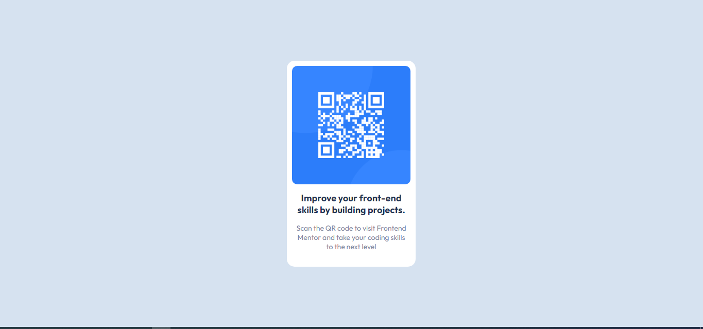

# Frontend Mentor - QR code component solution

## URL: [https://pezemiwe.github.io/qr-code-component-main/](https://pezemiwe.github.io/qr-code-component-main/)

This is a solution to the [QR code component challenge on Frontend Mentor](https://www.frontendmentor.io/challenges/qr-code-component-iux_sIO_H). Frontend Mentor challenges help you improve your coding skills by building realistic projects.

### Screenshot

### Links

- Live Site URL: [https://pezemiwe.github.io/qr-code-component-main/](https://pezemiwe.github.io/qr-code-component-main/)

### Built with

- Semantic HTML5 markup
- CSS custom properties
- Flexbox

## Author

- Github - [Paul Ezemiwe](https://github.com/pezemiwe)
